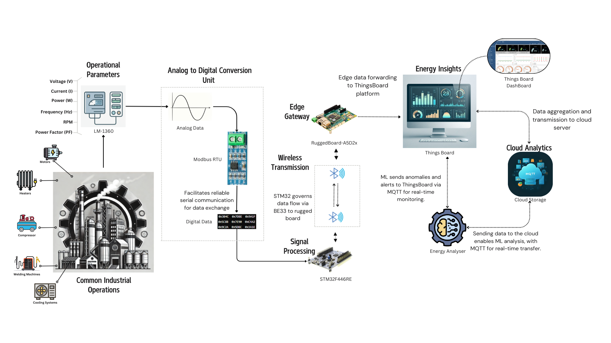
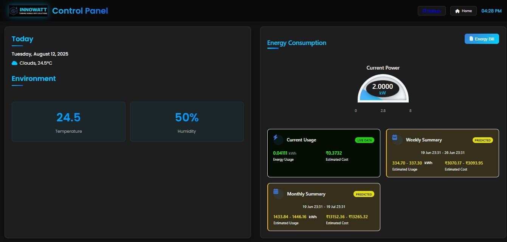

<!-- Banner -->
<h1 align="center">
  
</h1>

  
  
  

---

## 📌 Overview
> The **Advanced Industrial Energy Monitoring System (IEMS)** is built to empower industries with:  
> 📡 **Real-time Energy Monitoring** | 🛡 **Anomaly Detection** | 📈 **Predictive Analysis**

This project integrates **STM32 hardware**, **IoT protocols**, **ThingsBoard Cloud**, and **TensorFlow ML models** for next-gen industrial monitoring.

---

## 🏗️ System Architecture

  

---

## ✨ Features
- ✅ **Real-time Telemetry** from industrial energy meters  
- ✅ **ML-powered Anomaly Detection**  
- ✅ **Future Bill Prediction**  
- ✅ **Historical Data Trends**  
- ✅ **Modbus RTU + MQTT Communication**  

---

## 🛠️ Tech Stack

**🔧 Hardware:**
- STM32F446RE Microcontroller
- Energy Meter with Modbus RTU
- TTL to RS-485 Converter
- Bluetooth BE33 Module
- Rugged Board
- 4 Channel Relay

**💻 Software & Tools:**

  
  
  
  
  

---

## 📷 Project Images
| Hardware Kit | [🚀 Innowatt Dashboard](https://iems-user-interface-frontend.vercel.app) |
|--------------|--------------------------------------------|
|  |  |

---

## 📄 Research Paper
📄 [**View Conference Paper**](Conference_Paper_IEMS_F.pdf)

---

## 🌐 Live Demo / Dashboard
🔗 [**ThingsBoard Dashboard**](your-thingsboard-link)

---

## 👨‍💻 Contributors
<table>
<tr>
<td align="center"><b>Pramodh R S</b></td>
<td align="center"><b>Pavan Reddy S</b></td>
</tr>
<tr>
<td align="center"></td>
<td align="center"></td>
</tr>
</table>

---

## 📬 Contact

  
  

